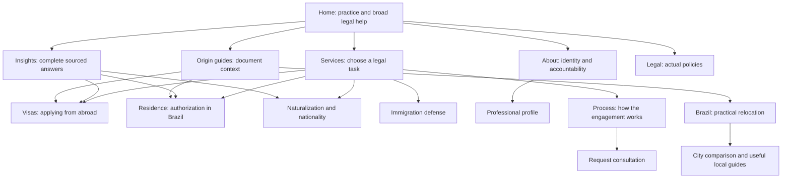

# Architecture, intent ownership and differentiation

The full keyword ledger is `05-keyword-url-map.csv`; exclusions reserve adjacent intents. Topics inferred from content are editorial assignments, not verified keyword volumes. Every URL has a record, including source-dependent articles and utility exclusions. Do not treat a populated row as evidence of publication readiness.

Implement equivalent Portuguese relationships where corresponding pages exist. Region/city pages describe relocation choices, not purported local offices. No new LocalBusiness location nodes or Google Business Profiles without a real eligible location. Verify the publicly used professional name, registration, phone and service address before extending entity assertions; do not publish invented credentials, awards or customer proof.

## SERP observations and remaining research

2026-09-08 web-search discovery queries: `Brazil immigration lawyer digital nomad family reunion visa legal assistance` and `advogada imigração autorização residência naturalização brasileira`. These are samples, not controlled Google top-ten rankings or comprehensive query-cluster research.

| Cluster / owner | Observed result approach | Material differentiation to implement |
|---|---|---|
| Broad legal help / home and services | [Stay Legal Brazil](https://staylegalbrazil.com/) identifies its team and separates pathways. | Show verified Monique identity, what the client receives, route-selection links and an accurate contact flow. |
| Nomad / visas/nomad and residencies/nomad | [Official consular instructions](https://www.gov.br/mre/pt-br/embaixada-windhoek/english/consular-services/visas-1/vitem-xiv-digital-nomad) define a jurisdiction-specific process. [Official residence booklet](https://portaldeimigracao.mj.gov.br/images/publicacoes/Cartilha-No%CC%82mades-INGLE%CC%82S_1.pdf) covers residence planning. | Put “applying abroad or already in Brazil?” before the paid offer; cite the competent authority for each path. Do not universalize one consulate's checklist. |
| Portuguese legal help / PT home and services | [Souza e Santos](https://souzaesantosimmigration.com/) groups visas, residence and naturalization. | Use natural Portuguese terms and distinct tasks: visto, autorização de residência, registro migratório, naturalização. Explain engagement scope and responsibility clearly. |
| Same professional on another domain | Search surfaced [Monique's digital-nomad family page](https://monique-fernandes.com/digital-nomad-pages/bring-your-family-to-brazil-remotely). | INFERENCE: cross-domain topic overlap warrants a portfolio review. Verify ownership and actual copy/intent before choosing different audience roles or migration. Do not automatically canonicalize either domain. |

Service-specific competitor depth, origin-language research, city queries and controlled mobile/country SERPs remain uncompleted. Existing service drafts should not claim to be backed by research for every query cluster. Use the official law/authority for legal facts; commercial competitor pages support only observations about their content and positioning.

## Content and conversion priorities

On service pages distinguish eligibility information from what legal representation includes. Move the task explanation above landscape-led promotion. Keep the consultation request visible after the explanation of scope. Suggested CTA: “Request a consultation”; PT: “Solicitar uma consulta”. State what happens after submission and whether payment/confirmation is separate. Prices, response times, acceptance conditions and refund terms require actual practice details; do not invent them.

Keep one profile as the central identity destination. Differentiate personal story, professional registration and client experience pages only where each contains distinct real information. Consolidation candidates remain conditional in 06 and 12. About/privacy/terms/contact pages provide accountability; more schema cannot substitute for missing policies or substantiated credentials.

For each article, recover its original question, answer, date and source before placing it in a topic cluster. Do not promote an archive page merely because its URL contains a useful phrase. For each country guide, source issuing authorities, authentication/translation guidance and consular context rather than swapping the country name into generic paragraphs.
